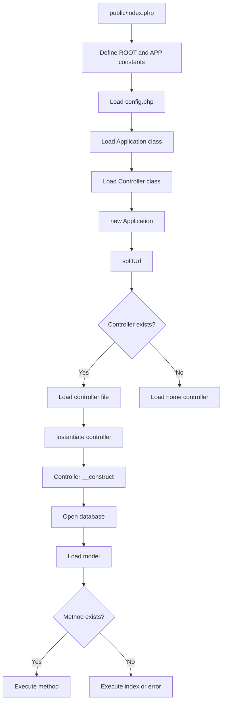

## Overview

MINI implements a classic **Model-View-Controller (MVC)** architectural pattern, separating application logic into three interconnected components. This separation promotes organized, maintainable code and follows the principle of separation of concerns.

## Directory Structure

The framework follows a well-organized directory structure:

```
mini/
├── application/
│   ├── config/
│   │   └── config.php          # Configuration constants
│   ├── controller/
│   │   ├── home.php            # Home controller
│   │   └── songs.php           # Songs controller
│   ├── core/
│   │   ├── application.php     # Core routing logic
│   │   └── controller.php      # Base controller class
│   ├── model/
│   │   └── model.php           # Database model
│   ├── view/
│   │   ├── _templates/
│   │   │   ├── header.php      # Global header
│   │   │   └── footer.php      # Global footer
│   │   ├── home/               # Home views
│   │   └── songs/              # Songs views
│   └── libs/
│       └── helper.php          # Helper utilities
└── public/
    ├── index.php               # Application entry point
    ├── .htaccess               # URL rewriting rules
    ├── css/
    └── js/
```

<Note>
  The `public/` directory is the only folder exposed to the web. All application code remains protected outside the document root.
</Note>

## Request Lifecycle

Every request follows this flow:

### 1. Entry Point (`public/index.php`)

The entry point bootstraps the application:

```php
// Define path constants
define('ROOT', dirname(__DIR__) . DIRECTORY_SEPARATOR);
define('APP', ROOT . 'application' . DIRECTORY_SEPARATOR);

// Load configuration
require APP . 'config/config.php';

// Load core classes
require APP . 'core/application.php';
require APP . 'core/controller.php';

// Start the application
$app = new Application();
```

### 2. URL Rewriting (`.htaccess`)

Apache rewrites clean URLs to pass them to `index.php`:

```apache
RewriteEngine On

# If requested file/directory doesn't exist
RewriteCond %{REQUEST_FILENAME} !-d
RewriteCond %{REQUEST_FILENAME} !-f
RewriteCond %{REQUEST_FILENAME} !-l

# Rewrite to index.php with URL parameter
RewriteRule ^(.+)$ index.php?url=$1 [QSA,L]
```

This converts `yoursite.com/songs/edit/5` → `index.php?url=songs/edit/5`

### 3. Routing (`Application` class)

The `Application` class parses the URL and dispatches to the appropriate controller:

```php
public function __construct()
{
    // Parse URL into controller/action/params
    $this->splitUrl();
    
    // No controller? Load home page
    if (!$this->url_controller) {
        require APP . 'controller/home.php';
        $page = new Home();
        $page->index();
    }
    // Controller exists?
    elseif (file_exists(APP . 'controller/' . $this->url_controller . '.php')) {
        require APP . 'controller/' . $this->url_controller . '.php';
        $this->url_controller = new $this->url_controller();
        
        // Method exists?
        if (method_exists($this->url_controller, $this->url_action)) {
            // Call with parameters
            call_user_func_array(
                array($this->url_controller, $this->url_action),
                $this->url_params
            );
        }
    }
}
```

### 4. Controller Execution

The controller processes the request:

1. **Initialization**: Base `Controller` opens database connection and loads model
2. **Method Execution**: The specific action method runs (e.g., `index()`, `addSong()`)
3. **Data Processing**: Controller interacts with model to fetch/modify data
4. **View Rendering**: Controller loads views and passes data to them

### 5. View Rendering

Views generate HTML output with the data provided by the controller.

## MVC Component Interaction

Here's how the three layers work together:

<Steps>
  <Step title="Request arrives">
    User navigates to `/songs/edit/5`
  </Step>
  
  <Step title="Application routes">
    `Application` class identifies controller (`songs`), action (`edit`), and params (`[5]`)
  </Step>
  
  <Step title="Controller instantiates">
    `Songs` controller is created, which automatically:
    - Opens database connection
    - Instantiates the `Model` class
  </Step>
  
  <Step title="Action executes">
    The `editSong(5)` method runs:
    ```php
    public function editSong($song_id)
    {
        $song = $this->model->getSong($song_id);
        
        require APP . 'view/_templates/header.php';
        require APP . 'view/songs/edit.php';
        require APP . 'view/_templates/footer.php';
    }
    ```
  </Step>
  
  <Step title="Model queries database">
    `Model::getSong()` executes:
    ```php
    public function getSong($song_id)
    {
        $sql = "SELECT id, artist, track, link FROM song WHERE id = :song_id LIMIT 1";
        $query = $this->db->prepare($sql);
        $query->execute([':song_id' => $song_id]);
        return $query->fetch();
    }
    ```
  </Step>
  
  <Step title="View renders">
    The edit view displays the form with `$song` data available
  </Step>
</Steps>

## Bootstrap Process

The framework initializes in this sequence:



## Configuration (`config.php`)

The configuration file defines application constants:

```php
// Environment
define('ENVIRONMENT', 'development');

// URL configuration (auto-detected)
define('URL_PUBLIC_FOLDER', 'public');
define('URL_PROTOCOL', '//');
define('URL_DOMAIN', $_SERVER['HTTP_HOST']);
define('URL_SUB_FOLDER', str_replace(URL_PUBLIC_FOLDER, '', dirname($_SERVER['SCRIPT_NAME'])));
define('URL', URL_PROTOCOL . URL_DOMAIN . URL_SUB_FOLDER);

// Database credentials
define('DB_TYPE', 'mysql');
define('DB_HOST', '127.0.0.1');
define('DB_NAME', 'mini');
define('DB_USER', 'root');
define('DB_PASS', 'your_password');
define('DB_CHARSET', 'utf8');
```

<Warning>
  Never commit `config.php` with real database credentials to version control. Use environment variables or a separate config file that's gitignored.
</Warning>

## Key Design Principles

### 1. Separation of Concerns

- **Models** handle data and business logic
- **Views** handle presentation
- **Controllers** coordinate between models and views

### 2. Single Entry Point

All requests go through `public/index.php`, providing centralized:
- Security checks
- Configuration loading
- Error handling
- Routing logic

### 3. Convention Over Configuration

The framework uses naming conventions:
- Controller file `songs.php` contains class `Songs`
- URL `/songs/index` maps to `Songs::index()`
- Views are organized in folders matching controller names

### 4. Base Classes

The `Controller` base class provides shared functionality:
- Database connection (`$this->db`)
- Model access (`$this->model`)
- Automatic initialization

## Related Documentation

<CardGroup cols={2}>
  <Card title="Routing System" icon="route" href="/concepts/routing">
    Learn how URLs map to controllers and actions
  </Card>
  
  <Card title="Controllers" icon="gamepad" href="/concepts/controllers">
    Deep dive into controller structure and methods
  </Card>
  
  <Card title="Models" icon="database" href="/concepts/models">
    Understand the data layer and database operations
  </Card>
  
  <Card title="Views" icon="eye" href="/concepts/views">
    Learn about view rendering and templating
  </Card>
</CardGroup>